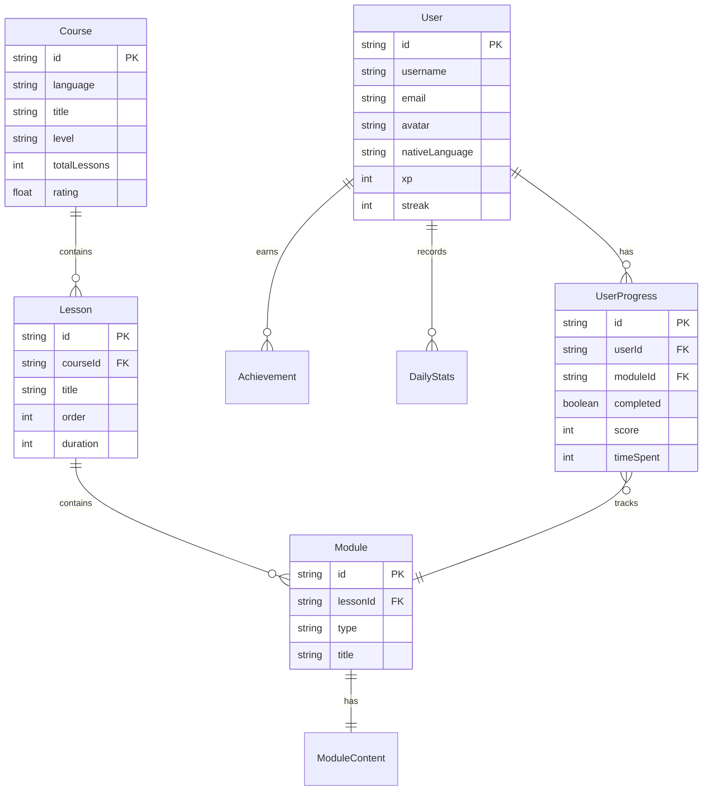

## 1. 架构设计

```mermaid
flowchart TB
    subgraph "Frontend Layer"
        "A[React SPA]"
        "B[State Management - Zustand]"
        "C[React Router]"
    end
    
    subgraph "Data Layer"
        "D[Local Storage - User Data]"
        "E[IndexedDB - Course Cache]"
        "F[Mock Data Service]"
    end
    
    subgraph "External Services"
        "G[Web Speech API - Voice]"
        "H[Web Audio API - Audio]"
    end
    
    "A" --> "B"
    "A" --> "C"
    "B" --> "D"
    "B" --> "E"
    "A" --> "F"
    "A" --> "G"
    "A" --> "H"
```

## 2. 技术说明

- **前端框架**: React@19 + TypeScript + Vite
- **样式方案**: Tailwind CSS@4 (内联样式 + CSS变量)
- **状态管理**: Zustand (轻量级状态管理)
- **路由**: React Router DOM@7
- **图表**: Recharts (学习统计图表)
- **动画**: Framer Motion (页面过渡和交互动画)
- **图标**: Lucide React
- **数据存储**: LocalStorage + IndexedDB (模拟后端数据)
- **语音功能**: Web Speech API (口语跟读)
- **音频处理**: Web Audio API (听力训练)

## 3. 路由定义

| 路由 | 用途 | 权限 |
|------|------|------|
| `/` | 首页，展示课程推荐和学习进度 | 公开 |
| `/login` | 用户登录页面 | 公开 |
| `/register` | 用户注册页面 | 公开 |
| `/courses` | 课程中心，浏览所有课程 | 公开 |
| `/courses/:language` | 特定语言的课程列表 | 公开 |
| `/courses/:language/:courseId` | 课程详情页 | 公开 |
| `/learn/:courseId/:lessonId` | 学习模块页面 | 需登录 |
| `/learn/:courseId/:lessonId/vocabulary` | 词汇记忆模块 | 需登录 |
| `/learn/:courseId/:lessonId/grammar` | 语法练习模块 | 需登录 |
| `/learn/:courseId/:lessonId/speaking` | 口语跟读模块 | 需登录 |
| `/learn/:courseId/:lessonId/listening` | 听力训练模块 | 需登录 |
| `/profile` | 个人中心首页 | 需登录 |
| `/profile/stats` | 学习统计详情 | 需登录 |
| `/profile/achievements` | 成就系统 | 需登录 |
| `/profile/settings` | 个人设置 | 需登录 |
| `/community` | 社区广场 | 公开 |
| `/community/leaderboard` | 排行榜 | 公开 |

## 4. API 定义 (模拟数据服务)

### 4.1 用户相关

```typescript
interface User {
  id: string;
  username: string;
  email: string;
  avatar?: string;
  nativeLanguage: Language;
  learningLanguages: Language[];
  level: Record<Language, number>;
  xp: number;
  streak: number;
  createdAt: string;
}

interface AuthState {
  user: User | null;
  isAuthenticated: boolean;
  login: (email: string, password: string) => Promise<boolean>;
  register: (username: string, email: string, password: string) => Promise<boolean>;
  logout: () => void;
}
```

### 4.2 课程相关

```typescript
type Language = 'english' | 'japanese' | 'korean' | 'chinese' | 'spanish' | 'french' | 'german';

type Level = 'A1' | 'A2' | 'B1' | 'B2' | 'C1' | 'C2';

type ModuleType = 'vocabulary' | 'grammar' | 'speaking' | 'listening';

interface Course {
  id: string;
  language: Language;
  title: string;
  titleNative: string;
  description: string;
  level: Level;
  thumbnail: string;
  totalLessons: number;
  duration: number;
  rating: number;
  enrolledCount: number;
  lessons: Lesson[];
}

interface Lesson {
  id: string;
  courseId: string;
  title: string;
  description: string;
  order: number;
  modules: Module[];
  duration: number;
}

interface Module {
  id: string;
  lessonId: string;
  type: ModuleType;
  title: string;
  content: ModuleContent;
}

interface VocabularyContent {
  words: VocabularyWord[];
}

interface VocabularyWord {
  id: string;
  word: string;
  pronunciation: string;
  meaning: string;
  example: string;
  audio: string;
}

interface GrammarContent {
  rules: GrammarRule[];
  exercises: GrammarExercise[];
}

interface GrammarRule {
  id: string;
  title: string;
  explanation: string;
  examples: string[];
}

interface GrammarExercise {
  id: string;
  type: 'fill-blank' | 'choice' | 'correction';
  question: string;
  options?: string[];
  answer: string;
  explanation: string;
}

interface SpeakingContent {
  phrases: SpeakingPhrase[];
}

interface SpeakingPhrase {
  id: string;
  text: string;
  translation: string;
  audio: string;
  difficulty: number;
}

interface ListeningContent {
  audioUrl: string;
  transcript: string;
  questions: ListeningQuestion[];
}

interface ListeningQuestion {
  id: string;
  type: 'choice' | 'fill-blank';
  question: string;
  options?: string[];
  answer: string;
}
```

### 4.3 学习进度相关

```typescript
interface UserProgress {
  userId: string;
  courseId: string;
  lessonId: string;
  moduleId: string;
  completed: boolean;
  score: number;
  timeSpent: number;
  completedAt?: string;
}

interface DailyStats {
  date: string;
  studyTime: number;
  wordsLearned: number;
  exercisesCompleted: number;
  accuracy: number;
  xpEarned: number;
}

interface Achievement {
  id: string;
  type: 'streak' | 'words' | 'courses' | 'time' | 'special';
  name: string;
  description: string;
  icon: string;
  requirement: number;
  unlocked: boolean;
  unlockedAt?: string;
}
```

## 5. 数据模型

### 5.1 实体关系图



## 6. 项目目录结构

```
src/
├── components/
│   ├── common/
│   │   ├── Button.tsx
│   │   ├── Card.tsx
│   │   ├── Modal.tsx
│   │   ├── Progress.tsx
│   │   └── Badge.tsx
│   ├── layout/
│   │   ├── Header.tsx
│   │   ├── Sidebar.tsx
│   │   ├── Footer.tsx
│   │   └── Navigation.tsx
│   ├── home/
│   │   ├── HeroSection.tsx
│   │   ├── CourseRecommendations.tsx
│   │   ├── ProgressOverview.tsx
│   │   └── CommunityFeed.tsx
│   ├── courses/
│   │   ├── CourseCard.tsx
│   │   ├── CourseFilter.tsx
│   │   ├── CourseList.tsx
│   │   └── CourseDetail.tsx
│   ├── learning/
│   │   ├── VocabularyModule.tsx
│   │   ├── GrammarModule.tsx
│   │   ├── SpeakingModule.tsx
│   │   ├── ListeningModule.tsx
│   │   └── ModuleProgress.tsx
│   ├── profile/
│   │   ├── StatsChart.tsx
│   │   ├── AchievementGrid.tsx
│   │   └── LearningPath.tsx
│   └── community/
│       ├── Leaderboard.tsx
│       ├── ActivityFeed.tsx
│       └── UserCard.tsx
├── pages/
│   ├── Home.tsx
│   ├── Login.tsx
│   ├── Register.tsx
│   ├── Courses.tsx
│   ├── CourseDetail.tsx
│   ├── LearningModule.tsx
│   ├── Profile.tsx
│   └── Community.tsx
├── store/
│   ├── authStore.ts
│   ├── courseStore.ts
│   ├── progressStore.ts
│   └── settingsStore.ts
├── services/
│   ├── mockData.ts
│   ├── courseService.ts
│   ├── progressService.ts
│   └── speechService.ts
├── hooks/
│   ├── useAuth.ts
│   ├── useProgress.ts
│   ├── useSpeech.ts
│   └── useAudio.ts
├── utils/
│   ├── constants.ts
│   ├── helpers.ts
│   └── i18n.ts
├── types/
│   ├── index.ts
│   ├── user.ts
│   ├── course.ts
│   └── progress.ts
├── App.tsx
├── main.tsx
└── index.css
```

## 7. 关键技术实现

### 7.1 语音识别与评分 (口语跟读)

使用 Web Speech API 实现实时语音识别，对比用户发音与标准发音，计算相似度评分。

### 7.2 学习进度持久化

使用 LocalStorage 存储用户基本数据，IndexedDB 缓存课程内容，实现离线学习支持。

### 7.3 成就系统触发

基于事件驱动的成就检测，在用户完成特定行为时触发成就检查。

### 7.4 个性化推荐算法

基于用户学习历史、正确率、学习时长等数据，使用简单的协同过滤算法推荐适合的课程。
